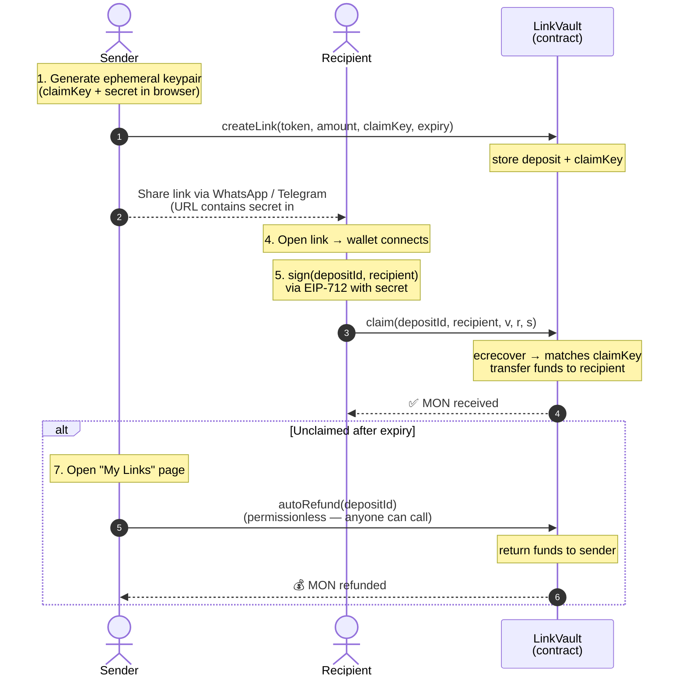

# MonliPay — Send MON via a link

> Send tokens on Monad as easily as sharing a WhatsApp link. Recipient clicks, funds arrive. Unclaimed? Auto-refunded.

Built for the **BuildAnything "Spark"** hackathon on Monad.

**Why I built this →** see [`STORY.md`](./STORY.md) (the real-world problem behind this project, not a marketing pitch).

**How to demo in 3 minutes →** see [`DEMO.md`](./DEMO.md).

---

## Problem

Every time you want to send crypto to a friend, you have to:

1. Ask for their wallet address
2. Copy-paste it carefully
3. Check the first and last 4 digits
4. Hope you're on the right chain

Friends without a wallet? They can't receive anything at all.

## Solution

MonliPay turns token transfers into a shareable link:

1. **Create** — deposit MON (or any ERC-20) into the LinkVault contract
2. **Share** — send the link via WhatsApp, Telegram, or any messenger
3. **Claim** — recipient opens the link, connects their wallet, claims with one click
4. **Auto-refund** — if nobody claims before expiry, the funds return to the sender automatically the next time the sender opens "My Links"

No address swapping. No chain confusion. One link is all you need.

---

## How It Works

### Secret-based claim (front-run resistant)

The core trick: the sender generates an **ephemeral keypair** in the browser using `crypto.getRandomValues`. The public address (`claimKey`) goes on-chain; the private key (the "secret") goes into the URL **fragment** (`#`).

```
https://monlipay.app/claim#42-5Kd3NBU5...
                          └─────────────┘
                          URL fragment — never sent to any server
```

When the recipient claims, their browser signs `(depositId, recipient)` via **EIP-712 typed data** with the secret key. The contract verifies the signature with `ecrecover` against `claimKey`.

Since the secret never appears in calldata, mempool watchers **cannot** front-run the claim transaction.

### Flow diagram



**Why this is front-run resistant:** the secret key lives only in the URL fragment (`#`). Browsers never send the fragment to any server, so mempool watchers cannot see the signature before your transaction confirms.

---

## Smart Contract — LinkVault.sol

A single contract with three core functions plus a permissionless auto-refund:

| Function | Description |
|---|---|
| `createLink(token, amount, claimKey, expiry)` | Deposit tokens (MON native or ERC-20), register claim key |
| `claim(depositId, recipient, v, r, s)` | Claim funds with a valid EIP-712 signature |
| `refund(depositId)` | Sender reclaims unclaimed funds after expiry |
| `autoRefund(depositId)` | **Permissionless** — anyone can trigger a refund to the original sender after expiry |
| `claimFailedRefund(depositId, recipient)` | Pull-pattern fallback if a push-transfer to sender fails (e.g. sender is a contract that rejects ETH) |

### Security features

- **`ReentrancyGuardTransient`** — uses Cancun `tstore`/`tload` opcodes (zero storage cost reentrancy protection)
- **`SafeERC20`** — handles non-standard tokens like USDT that don't return a bool
- **EIP-712 domain separation** — prevents cross-chain and cross-contract signature replay
- **EIP-2 s-value malleability check** — rejects high-order s-values and invalid v to prevent signature replay
- **Explicit `signer == address(0)` check** — defensive measure against `ecrecover`'s silent zero return
- **Expiry race fix** — at exact expiry, BOTH `claim()` and `refund()` revert (1-second no-mans-land prevents races)
- **Pull-pattern fallback** — failed ETH pushes (e.g. contract recipient that reverts on receive) park in `failedRefunds[]` instead of bricking the deposit
- **Fee-on-transfer support** — two-point balance reconciliation in both deposit and payout paths so the vault never tries to pay out more than it holds
- **Effects-before-interactions** — state updated before external transfers
- **Custom errors** — gas-efficient reverts (no string storage)

### Contract address

| Network | Chain ID | Address | Explorer |
|---|---|---|---|
| **Monad Testnet** | 10143 | [`0xEB9a0BC1c7518F839B8F249E407A1AfC011E0aB3`](https://testnet.monadscan.com/address/0xEB9a0BC1c7518F839B8F249E407A1AfC011E0aB3) | Monadscan |
| **Monad Mainnet** | 143 | _— deploy in progress, see `DEPLOY-VPS.md`_ | — |

The testnet contract has been live since July 2026 and is the recommended starting point for judges and reviewers. Try it at **https://testnet.monlipay.xyz** (testnet MON only — no real value at risk).

---

## Frontend

| Layer | Technology |
|---|---|
| Framework | Next.js 16 (App Router, Turbopack) |
| Web3 | wagmi v2 + viem v2 |
| Wallet UI | RainbowKit v2 (popup modal, MetaMask, WalletConnect, etc.) |
| Styling | Tailwind CSS v4 |
| Dark mode | next-themes (system / light / dark toggle) |
| 3D landing | three.js + @react-three/fiber + @react-three/drei |
| Bridge | LI.FI SDK (bridge tokens from other chains into MON) |
| Testing | Vitest + Testing Library (539 tests) |
| Coverage | 90.5% statements / 86.8% branches / 90.8% functions / 93.4% lines |
| Hosting | Vercel |

### Pages

- **`/`** — Create a payment link (select token, amount, expiry → get shareable URL)
- **`/claim`** — Claim a payment link (parse secret from URL hash → sign → claim)
- **`/my-links`** — Track created links; expired links auto-refund on page open
- **`/bridge`** — Bridge tokens from 9+ chains into Monad via LI.FI aggregator

### Features

- **RainbowKit wallet modal** — branded popup with MetaMask, WalletConnect, Coinbase, and more
- **Dark mode** — system-aware with manual toggle (sun/moon icon)
- **3D landing hero** — animated three.js scene with the Monad violet palette
- **Wrong-chain guard** — detects when wallet is on the wrong network and prompts switch
- **WhatsApp / Telegram share** — one-click share with pre-filled message
- **Cross-tab sync** — links created in one tab appear immediately in other tabs
- **Permissionless auto-refund** — opening "My Links" refunds all expired links in one batch
- **Per-link failure surfacing** — if auto-refund skips a link (e.g. race), the UI flags it individually
- **Bridge integration** — bring tokens from Ethereum, Base, Arbitrum, Optimism, Polygon, BNB, Avalanche → Monad
- **Real token/chain logos** — pulled from trustwallet/assets, with official Monad brand-kit SVG
- **URL scheme validation** — shareable URLs are sanitized to reject `javascript:`/`data:`/credential injection

---

## Project Structure

```
paymentlink/
├── contracts/                       # Foundry project
│   ├── src/
│   │   └── LinkVault.sol            # Core contract: create / claim / refund / autoRefund
│   ├── test/
│   │   ├── LinkVault.t.sol          # Core flows + expiry boundary + fuzz
│   │   ├── LinkVaultAuditFixes.t.sol # Audit round 2 fixes (race, pull, fee-token, signer-0)
│   │   ├── LinkVaultCoverage.t.sol  # Revert paths for coverage
│   │   ├── LinkVaultSecurity.t.sol  # Malleability, reentrancy, non-standard tokens
│   │   └── mocks/
│   │       ├── MaliciousERC20.sol       # Reentrancy-attacking token
│   │       ├── MockFeeOnTransferERC20.sol # Configurable fee in bps
│   │       ├── MockNonStandardERC20.sol # USDT-style (no bool return)
│   │       └── ETHRefuser.sol           # Reverts on receive (for pull-pattern test)
│   ├── script/
│   │   └── DeployLinkVault.s.sol
│   └── foundry.toml
├── web/                             # Next.js 16 frontend
│   └── src/
│       ├── app/                     # Pages: /, /claim, /my-links, /bridge, /api/bridge/*
│       ├── components/              # ConnectButton, CreateForm, ClaimForm, LinkCard, Scene3D, ...
│       ├── config/                  # Chain config + wagmi config + token list
│       ├── hooks/                   # useCreateLink, useClaimLink, useAutoRefundExpiredLinks, useBridge, ...
│       └── lib/                     # ABI, crypto (EIP-712), storage, bridge-client, rate-limit
└── README.md
```

---

## Quick Start

### Prerequisites

- [Foundry](https://www.getfoundry.sh/) (smart contract development)
- Node.js 20+ (frontend)
- MetaMask or any EVM wallet

### 1. Deploy the contract

```bash
cd contracts
forge install

# Deploy to Monad Testnet
forge script script/DeployLinkVault.s.sol \
  --rpc-url https://testnet-rpc.monad.xyz \
  --private-key $YOUR_PRIVATE_KEY \
  --broadcast

# Note the deployed address from the output, then verify on Monadscan:
# https://testnet.monadscan.com/address/<your-address>

# (Optional) Verify source on Sourcify
forge verify-contract <your-address> LinkVault \
  --chain-id 10143 \
  --verifier sourcify \
  --verifier-url https://sourcify.dev/server/
```

### 2. Set up the frontend

```bash
cd web
npm install

# Configure environment
cp .env.testnet .env.local
# Edit .env.local:
#   - Set NEXT_PUBLIC_LINK_VAULT_ADDRESS to your deployed address
#   - Set NEXT_PUBLIC_WC_PROJECT_ID (free at cloud.walletconnect.com)
#   - (Optional) Set LIFI_API_KEY and ALCHEMY_API_KEY for the bridge feature

npm run dev
```

Open http://localhost:3000

### 3. Run tests

```bash
# Smart contract tests (92 tests, 100% line coverage on LinkVault.sol)
cd contracts
forge test -vv

# Frontend tests (539 tests, 90%+ coverage)
cd ../web
npm test

# Frontend coverage report
npm run test:coverage
```

---

## Testing

### Smart Contracts — 92 tests

| Suite | Tests | Coverage |
|---|---|---|
| `LinkVault.t.sol` | 46 | Core flows: create, claim, refund, double-claim, expiry boundary, fuzz |
| `LinkVaultAuditFixes.t.sol` | 20 | Audit round 2 fixes: race window, pull-pattern, fee-on-transfer, signer-0, sweep |
| `LinkVaultCoverage.t.sol` | 15 | All revert paths and error conditions |
| `LinkVaultSecurity.t.sol` | 11 | Signature malleability, reentrancy (native + ERC-20), non-standard tokens |

**Line coverage: 100% on `LinkVault.sol`.**

### Frontend — 539 tests

| Area | Coverage |
|---|---|
| Statements | 90.5% |
| Branches | 86.8% |
| Functions | 90.8% |
| Lines | 93.4% |

Covers all components, hooks, config, and utility libraries. Includes:
- Create / Claim / Refund / Auto-refund flows (with mutex, AbortController, per-link failures)
- Crypto utilities (keypair generation, EIP-712 signing, URL sanitization)
- Storage (localStorage link persistence, cross-tab sync)
- Bridge client (LI.FI quote parsing, route validation)
- Rate limiting & security headers

---

## Security Audit

Two rounds of pre-mainnet audit were performed. All findings resolved.

### Round 1 — 7 must-fix items (commit `2cb29e6`)
Reentrancy guards, signature malleability, expiry validation, etc.

### Round 2 — 5 HIGH + 6 MEDIUM/LOW findings (commit `1c5d4ad`)
- **HIGH-1**: Closed expiry race window (1-second no-mans-land)
- **HIGH-2**: Pull-pattern fallback for failed native ETH pushes
- **HIGH-3**: Ref-based mutex in `useAutoRefundExpiredLinks` (nonce-race prevention)
- **HIGH-4**: Cross-tab localStorage sync
- **HIGH-5**: Per-link error surfacing for auto-refund
- **MEDIUM-1**: Fee-on-transfer token support (two-point reconciliation)
- **MEDIUM-2**: Explicit `signer == address(0)` check
- **MEDIUM-5**: State cleanup on wallet disconnect
- **MEDIUM-7**: `sanitizeBaseUrl()` prevents `javascript:`/`data:`/credential injection
- **MEDIUM-10**: AbortController for stale auto-refund batches
- **LOW-5**: Toast auto-dismiss

---

## Tech Stack

- **Blockchain:** Monad — Ethereum-compatible L1, 10,000 TPS, 400ms blocks
- **Smart Contracts:** Solidity 0.8.28 + Foundry
- **Frontend:** Next.js 16 + wagmi v2 + viem v2 + RainbowKit v2
- **3D:** three.js + @react-three/fiber
- **Bridge:** LI.FI SDK
- **Styling:** Tailwind CSS v4 + next-themes (dark mode)
- **Testing:** Foundry (contracts) + Vitest (frontend)
- **Coverage:** 100% contract lines / 90%+ frontend statements

## License

MIT
